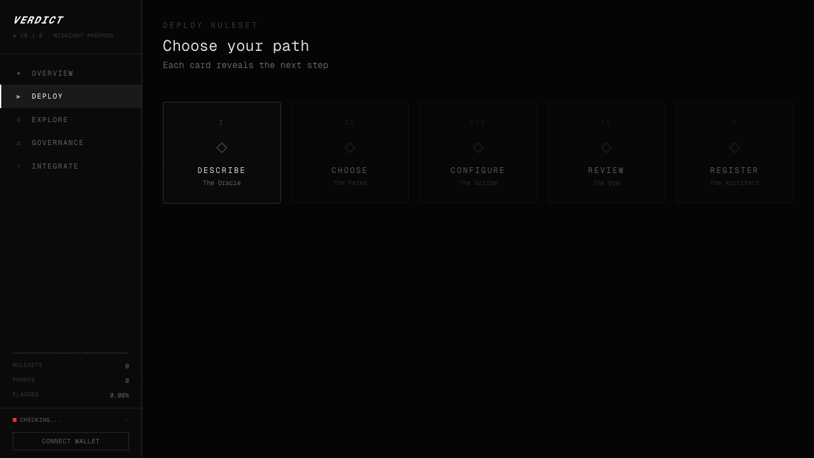
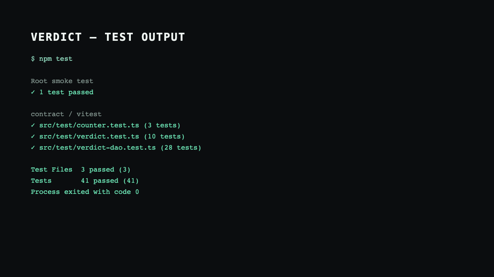

# VERDICT

This project is built on the [Midnight Network](https://midnight.network/).

[](https://github.com/arko05roy/VERDICT/actions/workflows/ci.yml)
[](https://verdict-jade.vercel.app)


## Contract Addresses (Preprod)

Deployed from the unmodified Compact sources in `contract/src` on July 23, 2026.
Both deployments are independently visible through the Preprod indexer.

| Contract | Address | Transaction / block |
|----------|---------|---------------------|
| **VERDICT reference verifier** (`verdict.compact`) | [`b3b8f32f51d28ca2265e29da8be2d08cd5c20ae4152adfdd452bdee9fc6242e3`](https://preprod.midnightexplorer.com/contracts/0xb3b8f32f51d28ca2265e29da8be2d08cd5c20ae4152adfdd452bdee9fc6242e3) | `c5a9d20d3719b1cfb1ee471999c47c382d370cbe860b0a99bac9a641495d6bbd` / `1784908` |
| **VERDICT DAO** (`verdict-dao.compact`, threshold `1`) | [`257219f97796f9447d155fff4dfdf8c29decde9ac6584afb32916ec0fabf835b`](https://preprod.midnightexplorer.com/contracts/0x257219f97796f9447d155fff4dfdf8c29decde9ac6584afb32916ec0fabf835b) | `a23bd277a3da3d78eb77319e5486565021e10164e34d3904e6acd3a014a01006` / `1785007` |


### *Verdict doesn't ask systems to be honest. It makes dishonesty mathematically impossible.*

**Universal Zero-Knowledge Integrity Protocol on Midnight**



### Test evidence



VERDICT provides a five-step ruleset deployment flow: describe the rules, choose
Guardians, configure parameters, review the generated Compact circuit, and
register the ruleset on Midnight.

---

## The Problem

Every day, you interact with systems that enforce rules you cannot verify.

Your insurance claim — processed by an algorithm you can't inspect. Your trade on an exchange — executed at a price you have to trust. Your loan application — scored by a model that won't show its math. Your game — adjudicated by a server that could be lying about every outcome.

These aren't edge cases. This is the default. Every platform, every service, every institution that processes your data runs the same architecture: a black box that takes your inputs, applies rules internally, and tells you what happened. You have no proof the rules were followed. None.

**The entity enforcing the rules is often the same entity that profits from breaking them.**

There is zero cryptographic proof that any rule was ever applied correctly. You're trusting a `console.log` on someone else's server.

That's not integrity. That's faith.

---

## What Is VERDICT?

VERDICT is a universal ZK integrity protocol built on Midnight. It doesn't replace existing systems. It doesn't touch business logic. It sits underneath and asks one question: **was this state transition valid?**

Every state transition is checked by a ZK circuit. 10 mathematical checks per transition. Bounds validation, action legitimacy, behavioral entropy, commit-reveal verification — the works. The result is either **CLEAN** or **FLAGGED**. Not an accusation — a **proof**. Immutable, on-chain, verifiable by anyone.

What makes this a protocol and not a product: every system gets its own ruleset. Insurance claim processing, exchange trade execution, game anti-cheat, lending compliance — each one is a deployed Compact contract on Midnight. Different rules, same verification engine. You don't build a new system per use case. You deploy a ruleset.

### Where This Applies

VERDICT is domain-agnostic. Any system where participants must follow rules but shouldn't have to expose their data:

| Domain | What Gets Verified | What Stays Private |
|--------|-------------------|-------------------|
| **Gaming** | State transitions follow physics and game rules | Player positions, strategies, inputs |
| **Financial compliance** | Transactions stay within regulatory bounds | Account balances, counterparties, amounts |
| **Supply chain** | Goods moved through valid checkpoints in order | Supplier identities, pricing, routes |
| **Voting & governance** | Votes cast within eligibility rules | Who voted for what |
| **Marketplace integrity** | Bids and listings follow platform rules | Bidder identity, amounts, strategy |
| **IoT & sensor networks** | Readings fall within valid ranges and sequences | Raw sensor data, device locations |

---

## The 10 Checks

Every state transition runs through 10 layered integrity checks inside a single zero-knowledge proof. ~940 constraints. Lightweight enough for real-time settlement.

| # | Check | What It Catches |
|---|-------|-----------------|
| 1 | **Sequence Integrity** | Fabricated states, replayed data, skipped transitions |
| 2 | **Pre-Commitment Binding** | Retroactive data editing, after-the-fact manipulation |
| 3 | **Rate-of-Change Bounds** | Impossible state jumps — values that change too fast |
| 4 | **Second-Order Rate Bounds** | Gradual ramps that individually look fine but collectively are impossible |
| 5 | **Range Enforcement** | Values outside permitted boundaries |
| 6 | **Action Whitelist** | Operations that don't exist in the ruleset |
| 7 | **Frequency Limiting** | Automated flooding, bot-speed operations |
| 8 | **Behavioral Entropy** | Bot-like repetition, scripted automation loops |
| 9 | **Precision Anomaly** | Mechanically perfect inputs no human could produce |
| 10 | **Information Leakage** | Acting on data the participant shouldn't have access to |

Four violation classes:

- **Fabrication** (1-2) — *Was this state transition real, or was it injected?*
- **Constraint Violations** (3-5) — *Does this transition stay within defined bounds?*
- **Automation** (6-8) — *Is this a legitimate participant or a bot?*
- **Information Asymmetry** (9-10) — *Is the participant acting on hidden information?*

---

## Deploy — The Developer Story

Write rules in VCL, the deterministic Verdict Compile Language. Hit compile.
VERDICT validates the configuration and generates a Guardian-specific Compact
ZK circuit — Midnight's native language — for review and deployment.

```
"Claim payouts must match the policy tier."
"Trade execution price cannot deviate more than 0.1% from quoted price."
"Player health cannot go below zero."
```

That compiles to real Compact. The circuit runs inside Midnight's ZK prover. The
system under verification never sees the private data. The circuit sees
**witnesses** — private inputs that get verified and discarded. AI assistance,
when enabled, only recommends Guardians; it never generates circuit code.

From writing English rules to a live ZK verification endpoint. One workflow.

---

## Integrate — Three Lines of Code

```typescript
import { Verdict } from '@verdict/sdk'
const verdict = new Verdict('midnight1_abc123...')
const result = await verdict.verify({ prevState, currState, action })
```

Your system captures a state transition. The SDK submits it as a ZK witness — **private by default**. The circuit runs 10 checks. The proof settles on Midnight. You get back CLEAN or FLAGGED.

The user's data, the internal state, the business logic — none of it is ever revealed. Not to you, not to anyone.

TypeScript, Python, Rust, Go. Pick your stack. Plug in the address. You're done.

---

## The Dashboard

VERDICT ships with a protocol dashboard — not a demo.

| Page | What It Does |
|------|-------------|
| **Overview** | Real-time protocol health — rulesets deployed, verifications flowing, proofs settling |
| **Deploy** | Write enforcement rules in plain English, compile to Compact, deploy on-chain |
| **Explore** | Browse every deployed ruleset on the network — live feeds, flagged rates, integrity scores |
| **Explore/[id]** | Public integrity profile per ruleset — total verifications, flagged rate, all on-chain, all auditable |
| **Integrate** | Pick a ruleset, pick a language, copy the snippet |

No more trusting platforms when they say "we follow the rules." Show me the proof. Literally.

---

## Tech Stack

| Layer | Technology |
|-------|-----------|
| **Frontend** | Next.js 16, React 19, TypeScript 5, Tailwind CSS 4 |
| **ZK Circuit** | Compact (Midnight), @midnight-ntwrk/compact-runtime |
| **Blockchain** | Midnight Preprod (ledger v8) |
| **Proof Generation** | Midnight proof-server |
| **Wallet** | @midnight-ntwrk/wallet-sdk |
| **AI Assistance** | Google Gemini suggests Guardians and parameters only |
| **Infrastructure** | Docker Compose (node + indexer + proof-server) |
| **Testing** | Vitest |

---

## Project Structure

```
ratri/
├── verdict/                  # Next.js protocol dashboard
│   ├── src/app/              # Pages + API routes
│   ├── src/lib/              # Midnight simulator, Compact validator, Gemini integration
│   └── sdk/                  # Verdict SDK (TypeScript)
├── contract/                 # ZK circuits + Midnight JS wrappers
│   ├── src/verdict.compact       # Reference verifier — 10 checks, ~940 constraints
│   ├── src/verdict-dao.compact   # Guardian registry, council and ruleset governance
│   └── src/managed/              # Local test artifacts
├── tests/                    # Root-level contract smoke tests (rubric entry point)
│   └── verdict.test.ts
├── counter-cli/              # Midnight CLI + Docker orchestration
│   ├── standalone.yml        # Docker Compose: node + indexer + proof-server
│   └── src/standalone.ts     # Boot local Midnight stack
├── preprod-wallet-current/   # Wallet SDK 1.2 / Midnight.js 4.1 CLI deployer
│   ├── src/deploy-current.ts # Verifier + DAO deploy flow
│   └── src/managed/          # Preprod-compatible compiled artifacts
├── start.sh                  # One-command startup
└── README.md
```

---

## Running Locally

See [docs/setup.md](docs/setup.md) for prerequisites, environment variables, and
the full local/simulator workflow. See [docs/integration-guide.md](docs/integration-guide.md)
for SDK usage.

```bash
git clone <repo-url> && cd ratri
npm install
npm test          # runs root smoke test + contract suite (42 tests total)
bash start.sh
```

This starts the local Midnight stack (node, indexer, proof server) and the dashboard on `localhost:3000`.

For development without Docker (simulator mode):

```bash
cd verdict
npm run dev
```

The development server runs with Webpack explicitly (`next dev --webpack`) to
match the project configuration.

The simulator runs the full ZK circuit in-memory with pre-seeded example rulesets — no external infrastructure required.

---

### Reproduce the CLI deployment (no Lace)

The deployed artifacts use Compact `0.31.1`, Compact runtime `0.16.0`,
Midnight.js `4.1.1`, wallet SDK `1.2.0`, and proof-server `8.0.3`.

```bash
# From the repository root: start only the local proof server.
docker compose -f counter-cli/proof-server.yml up -d

cd preprod-wallet-current
npm ci

# Compile the actual repository contracts, including proving keys.
compactc \
  ../contract/src/verdict.compact src/managed/verdict
compactc \
  ../contract/src/verdict-dao.compact src/managed/verdict-dao

# First use of a funded seed: replay ordered wallet history and save tDUST state.
SEED=<64-character-funded-wallet-seed> npm run dust-parallel

# Deploy the verifier, then the DAO.
SEED=<same-seed> npm run deploy
SEED=<same-seed> npm run deploy:dao
```

The CLI connects to the remote Preprod node/indexer and the local proof server.
It balances fees from the wallet's derived tDUST subwallet, submits each
transaction, and writes `preprod-deploy.json` / `preprod-dao-deploy.json`.

> **tNIGHT → tDUST:** do not wait for 10,000 tNIGHT. These deployments used one
> 1,000-tNIGHT faucet grant. `npm run dust-parallel` fixes the apparent
> conversion failure by replaying the funded wallet's ordered indexer history
> and persisting `dust-snapshot.json`; the deploy commands refresh that
> checkpoint before proving. Never commit or publish the wallet seed.

For the web app, set `NEXT_PUBLIC_VERDICT_PREPROD_CONTRACT_ADDRESS` to the
reference verifier address above. Keep `MIDNIGHT_WALLET_SEED` server-only.

---

## Live Demo

- **App:** https://verdict-jade.vercel.app
- **Demo video:** https://youtu.be/O64oQYzj__o

Connect Lace on Preprod, then **Run Verification** on a ruleset in Explore.

The dashboard and API health endpoints are live, and the reference verifier and
DAO addresses above are confirmed on Preprod.

---

## Privacy Claim

VERDICT proves rule compliance **without revealing participant data**.

- **Private (never on-chain):** player positions, enemy coordinates, aim history, action sequences, nonces
- **Public (on-chain):** `CLEAN` / `FLAGGED` verdict, `totalChecks` / `totalFlagged` counters
- **Observable behavior:** Connect Lace → Run Verification on a ruleset → verdict appears on-chain while witness data stays in the browser

The circuit hashes hidden state inside the ZK proof. Observers verify *that* rules were followed, not *what* the data was.

---

## Privacy Model

What an observer **can** learn from the chain:

| Observable | Example |
|------------|---------|
| Verdict outcome | `CLEAN` or `FLAGGED` |
| Aggregate counters | `totalChecks`, `totalFlagged` |
| Contract address | Ruleset identity |
| Transaction IDs | Proof was submitted |

What an observer **cannot** learn:

| Hidden | Why |
|--------|-----|
| Player position / movement | Private witness — only velocity *bounds* checked in-circuit |
| Enemy positions | Hashed locally; circuit checks correlation without revealing coords |
| Individual actions | Witness data discarded after proof |
| Wallet identity link | Shielded addresses; selective disclosure only |

See [product proposal](docs/product-proposal.md) — **Private Allowlist Access** mapped to VERDICT's integrity gates.

---

## Demo Video

[Watch the VERDICT demo video on YouTube](https://youtu.be/O64oQYzj__o)

Shows wallet connect + circuit verification on [verdict-jade.vercel.app](https://verdict-jade.vercel.app).

Script reference: [`verdict/script.md`](verdict/script.md)

---

## Project Resources

- [Project document](https://docs.google.com/document/d/187WgVarkLMDn08igfaFlUGqLZlrx0auccuKh9k5ebgA/edit?usp=sharing)
- [Project spreadsheet](https://docs.google.com/spreadsheets/d/17PxdsaiEy9neLjag383xV-5owxRIc1nUu9KaH0QGbJU/edit?usp=sharing)

---

## Tests

```bash
npm test   # 42 tests (1 root + 10 verdict + 28 DAO + 3 files)
```

 — run `npm test` for live output (42 tests).

---

## Submission Readiness

The authoritative, judge-facing checklist is [docs/submission-checklist.md](docs/submission-checklist.md).
The short demo script is [docs/demo-script.md](docs/demo-script.md).
The Level 6 evidence pack is [USERS.md](USERS.md),
[LAUNCH_USERS.md](LAUNCH_USERS.md), [FEEDBACK.md](FEEDBACK.md),
[PROPOSAL.md](PROPOSAL.md), and the [docs index](docs/README.md).

## Level 2 / Level 3 Submission

| Requirement | Status |
|-------------|--------|
| Lace connect/disconnect | ✅ Sidebar wallet |
| Circuit from frontend | ✅ `verdict-client.ts` via Lace |
| Privacy behavior | ✅ Witness hidden, verdict public |
| Preprod contracts | ✅ Verifier + DAO deployed and indexer-confirmed |
| 20+ meaningful commits | ✅ 64 commits on `main` |
| 3+ tests | ✅ 42 passing |
| CI/CD | ✅ `.github/workflows/ci.yml` |
| Product proposal | ✅ `docs/product-proposal.md` |
| Demo video | ✅ [youtu.be/O64oQYzj__o](https://youtu.be/O64oQYzj__o) |
| Product X profile | ⏳ Create profile and replace the marked link in [docs/submission-checklist.md](docs/submission-checklist.md) |

---

## Contract Address (local dev)

| Contract | Network | Address |
|----------|---------|---------|
| **VERDICT** (`verdict.compact`) | Local standalone | `b9184c39f154e1284f17f53dcbb15a20361a2b159c9bf7b4118d7d958f674e99` |

Local deploy via `counter-cli/standalone.yml`. Preprod uses the deploy flow above.

---

## Why Midnight?

VERDICT needs a chain where privacy is native, not bolted on.

Midnight's dual-ledger model keeps aggregate verdicts public (anyone can audit) while all participant data stays private (only the prover ever sees it). The ZK circuit bridges the two: takes private inputs, produces public outputs, proves the relationship without revealing anything.

Remove Midnight and you're back to trusting a centralized verifier — which is the problem VERDICT exists to solve.

---

## The Hard Problems We Solved

**The Privacy Paradox** — Rule enforcement traditionally works by *seeing everything*. VERDICT works by *seeing nothing*. You hash hidden state, verify the hash on-chain, and check for statistical correlation *inside* the zero-knowledge circuit. The verifier never learns what the data was. They only learn whether the rules were followed.

**ZK Circuit Design Under Constraints** — Zero-knowledge circuits can't do everything a normal program can. No square roots. No floating point. No dynamic loops. Every check had to be redesigned for finite field arithmetic — Manhattan distance instead of Euclidean, cross products instead of angles, squared comparisons instead of roots. The result: 10 checks in ~940 constraints.

**Building on a Bleeding-Edge Chain** — Midnight's Compact language is powerful but barely documented. The tooling is young. We built a complete local simulator so the entire proof flow works end-to-end without depending on external infrastructure.

---

## Built For

**Midnight Assemble** — a builder program by the Midnight team.

VERDICT is infrastructure for a future where rule enforcement doesn't require surveillance.

---

*Built on Midnight. Proven in zero knowledge.*
