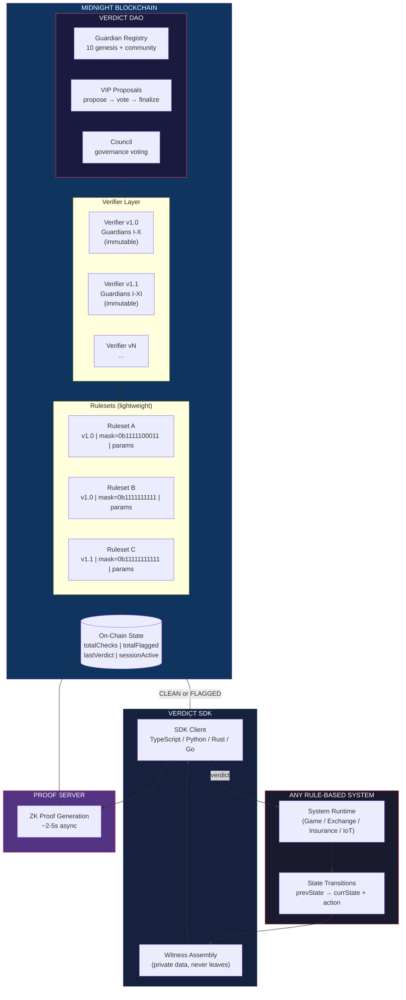
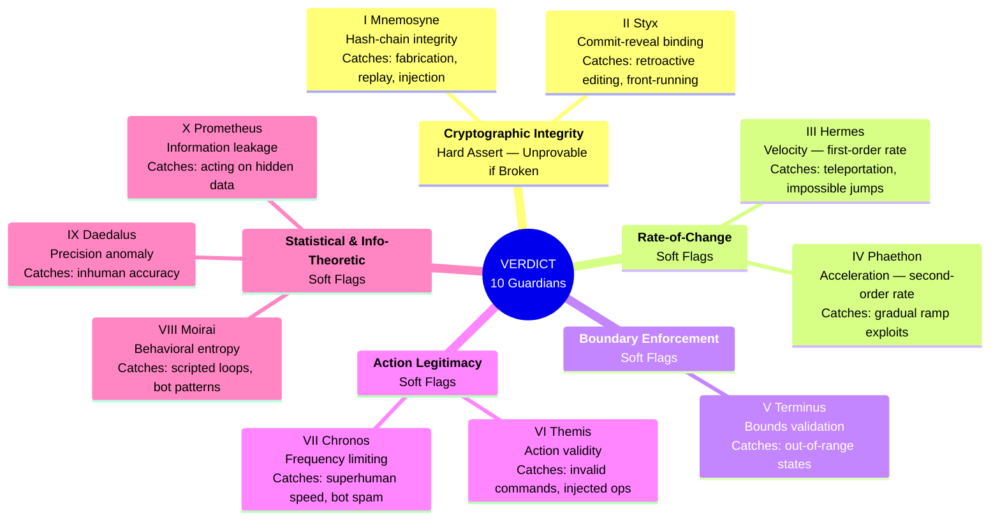
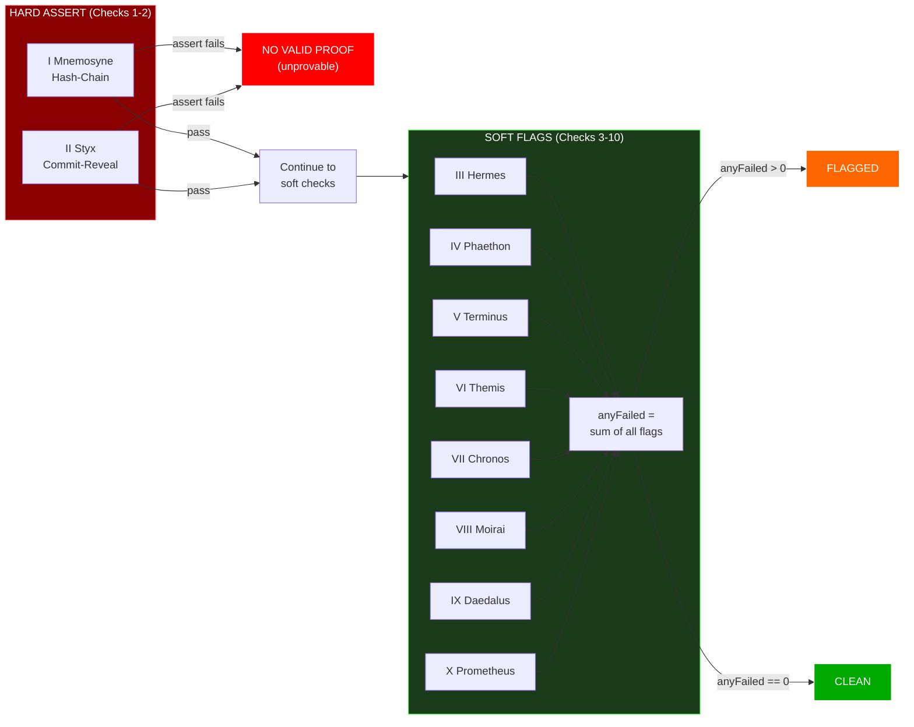
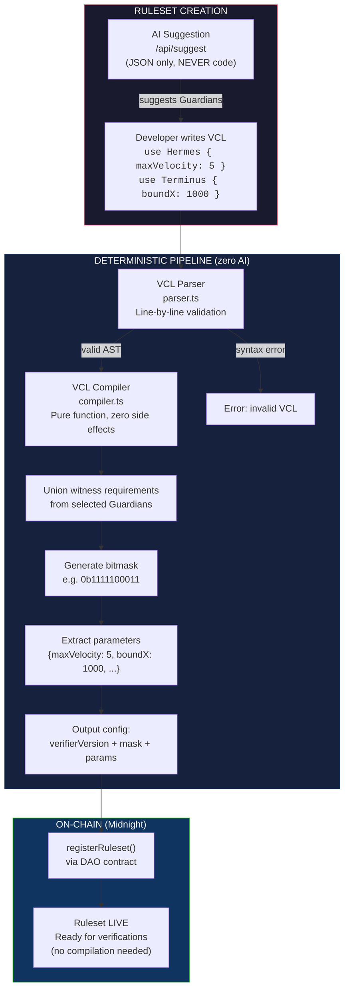
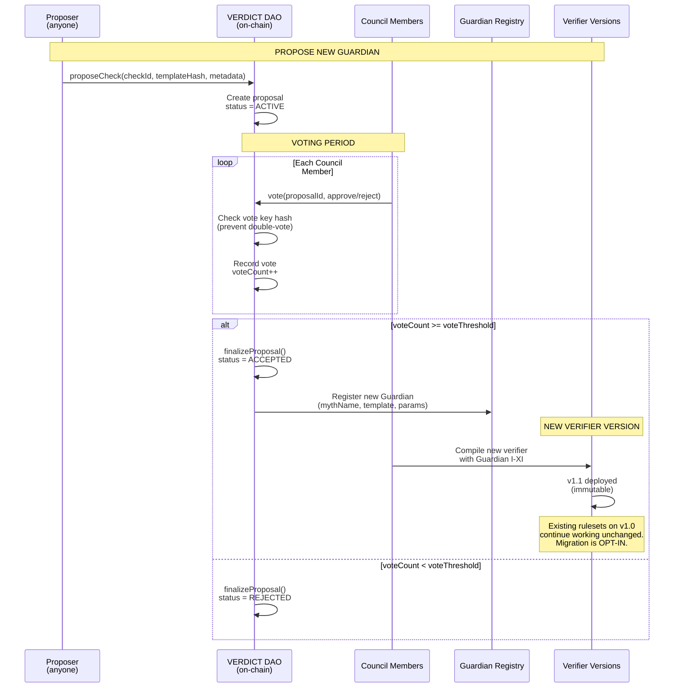
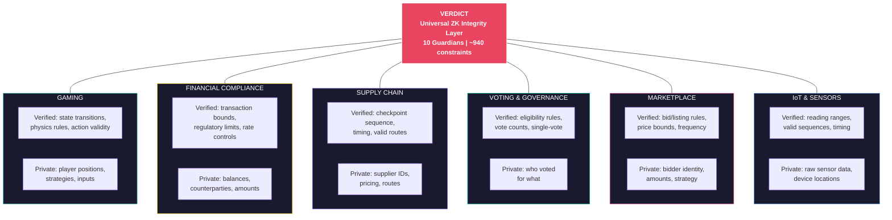
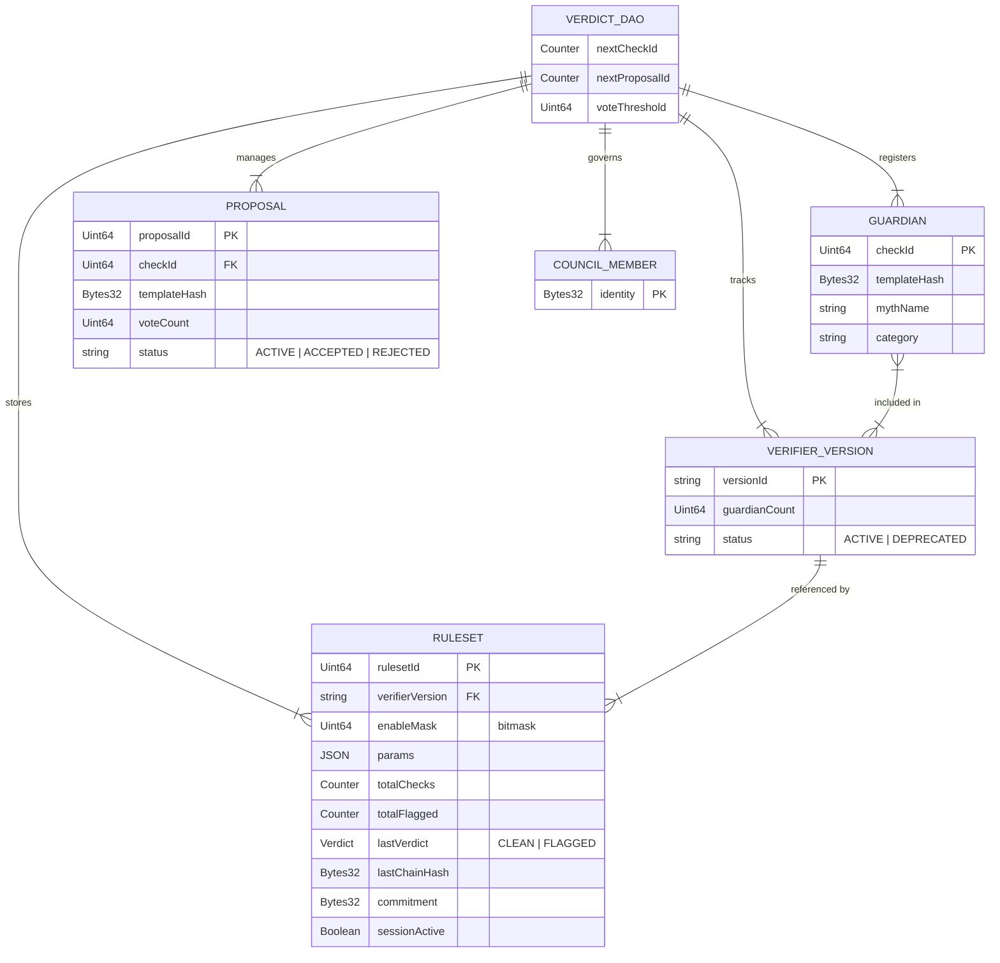

# VERDICT Protocol — Architecture Diagrams

---

## 1. High-Level Architecture



---

## 2. The 10 Guardians — Check Taxonomy



---

## 3. Guardian Aggregation Logic



---

## 4. Verification Flow — Sequence Diagram

```mermaid
sequenceDiagram
    participant SYS as System Runtime
    participant SDK as VERDICT SDK
    participant PS as Proof Server
    participant MN as Midnight Chain

    Note over SYS,MN: SESSION INITIALIZATION
    SYS->>SDK: Start new session
    SDK->>PS: startSession(genesisHash)
    PS->>MN: Deploy proof on-chain
    MN-->>SDK: sessionActive = true<br/>lastChainHash = genesisHash

    Note over SYS,MN: PER-TRANSITION LOOP (async, non-blocking)

    rect rgb(30, 30, 60)
        SYS->>SYS: Capture state transition<br/>(prevState → currState + action)

        Note over SYS,SDK: STEP 1: COMMIT
        SYS->>SDK: Commit to transition
        SDK->>SDK: hash(currPos, action, nonce)
        SDK->>PS: commitMove(commitment)
        PS->>MN: Store commitment on-chain

        Note over SYS,SDK: STEP 2: VERIFY
        SYS->>SDK: Submit witness data (private)
        SDK->>SDK: Assemble witnesses<br/>(positions, history, ticks, entities)
        SDK->>PS: verifyTransition(params, witnesses)

        Note over PS: ZK Proof Generation (~2-5s)
        PS->>PS: Run 10 Guardian checks<br/>inside ZK circuit (~940 constraints)
        PS->>MN: Submit proof on-chain

        MN->>MN: totalChecks++
        alt anyFailed > 0
            MN->>MN: totalFlagged++
            MN-->>SDK: verdict = FLAGGED
        else All checks pass
            MN-->>SDK: verdict = CLEAN
        end

        SDK-->>SYS: Return verdict
    end

    Note over SYS: System never pauses.<br/>Violations flagged retroactively.
```



---

## 5. VCL Compilation Pipeline



---

## 6. DAO Governance Flow



---

## 7. Domain Application Map



---

## 8. On-Chain State Model



---

## 9. Proof Lifecycle — State Diagram

```mermaid
stateDiagram-v2
    [*] --> Idle: System deployed

    Idle --> SessionActive: startSession(genesisHash)

    state SessionActive {
        [*] --> AwaitingCommit

        AwaitingCommit --> Committed: commitMove(hash)
        Committed --> Proving: verifyTransition(witnesses)

        state Proving {
            [*] --> RunningChecks
            RunningChecks --> HardAssert: Checks 1-2
            HardAssert --> SoftFlags: assert pass
            HardAssert --> Unprovable: assert fail
            SoftFlags --> Aggregating: Checks 3-10
            Aggregating --> VerdictReady
        }

        Proving --> Clean: anyFailed == 0
        Proving --> Flagged: anyFailed > 0
        Proving --> ProofInvalid: Hard assert failed

        Clean --> AwaitingCommit: next transition
        Flagged --> AwaitingCommit: next transition
    end

    SessionActive --> Idle: Session ends

    note right of Unprovable: No valid ZK proof exists.\nTampered data is mathematically\nunprovable, not just flagged.
```
